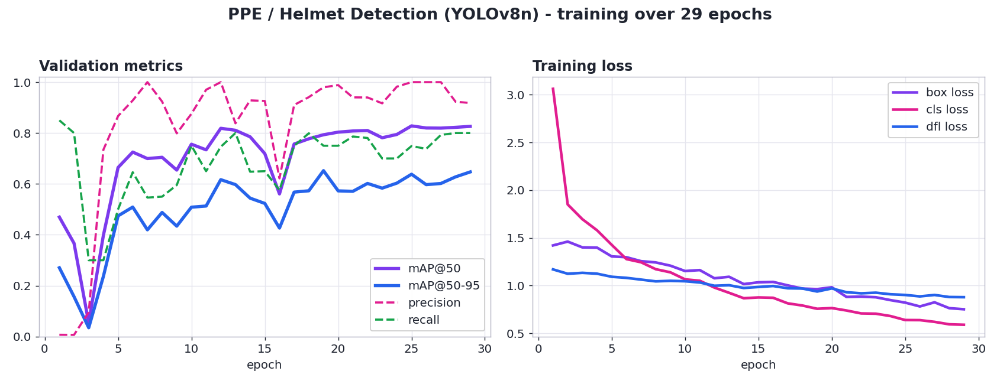

# PPE / Safety-Helmet Detection (YOLOv8)

An object-detection model that flags **safety helmets (hard hats)** in workplace
images. Built to practise the full computer-vision pipeline end to end: dataset
preparation, transfer-learning with YOLOv8, evaluation with mAP, inference on new
images, and a runnable web demo.

**Model:** YOLOv8n fine-tuned on a public hard-hat/PPE dataset. Single class: `helmet`.



## Results

Best checkpoint on the held-out validation set (29 epochs, YOLOv8n):

| Metric | Value |
| --- | --- |
| mAP@50 | 0.793 (peaked at 0.828 during training) |
| mAP@50-95 | 0.652 |
| Precision | 0.98 |
| Recall | 0.75 |
| Classes | helmet (hard hat) |

The chart above is this model's real training history, read from the saved
checkpoint: validation mAP and precision/recall climbing over epochs, and the
box/cls/dfl training losses falling.

## What is in here

```
notebooks/train_ppe_yolov8_colab.ipynb   train + evaluate on Colab's free GPU
infer.py                                  run detection on images / folders / video
hf_space/app.py                           a Gradio web demo you can run locally
weights/best.pt                           the trained model (6 MB)
docs/training_results.png                 training curves (above)
requirements.txt                          dependencies
sample_images/                            placeholder images for a plumbing test
```

## How it works

- **Task.** Object detection: for each image the model predicts bounding boxes
  plus a class and confidence for every object it finds. Harder than image
  *classification*, which only labels the whole image.
- **Model.** YOLOv8 ("You Only Look Once", v8) is a single-stage detector: one
  forward pass predicts all boxes at once, which is why it is fast enough for
  real-time and edge use. `n` (nano) is the smallest, fastest variant.
- **Transfer learning.** Training starts from `yolov8n.pt` (pretrained on COCO),
  so the model already knows general visual features and only needs fine-tuning on
  the hard-hat images rather than training from scratch.
- **Metric.** mAP (mean Average Precision). `mAP@50` counts a detection correct
  when its box overlaps the true box by at least 50% (IoU 0.5); `mAP@50-95`
  averages across stricter thresholds, so it is the tougher, more honest number.
- **Confidence threshold.** At inference you keep only detections above a
  confidence value. Raising it cuts false positives but can miss objects; the
  demo exposes this as a slider.

## Run it

**Inference (local):**
```bash
pip install -r requirements.txt
python infer.py --weights weights/best.pt --source path/to/your/images/
```
Annotated images are written to `runs/detect/predict/`. Point `--source` at a
folder, a single image, or a video. Use real workplace / construction photos with
hard hats; the bundled `sample_images/` are only there to confirm the plumbing
runs.

**Web demo (local Gradio):**
```bash
pip install -r hf_space/requirements.txt
python hf_space/app.py
```
Opens a local page where you upload an image and adjust the confidence slider.
The same `app.py` is written to drop straight into a Hugging Face Gradio Space if
you ever want it hosted (hosting a Gradio Space now needs a paid tier, so this
project keeps the demo runnable locally at no cost).

**Train (reproduce):** open `notebooks/train_ppe_yolov8_colab.ipynb` in Google
Colab, set the runtime to GPU, and run the cells. It installs YOLOv8, pulls a
public hard-hat/PPE dataset from Roboflow, trains, prints mAP, and downloads
`best.pt`.

## Notes

- Dataset licences belong to their authors on Roboflow Universe; this repo is the
  code and the trained model, not the data.
- `best.pt` is included so inference and the demo run out of the box.
